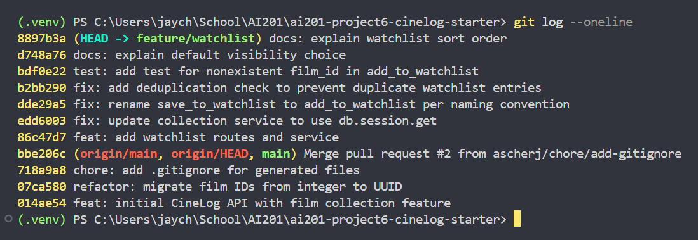

# PR Response Doc — CineLog Watchlist Feature

## AI Usage
I used AI for codebase orientation and review hygiene. Early on, I asked it to summarize the roles of `models.py`, `services/collection_service.py`, and `tests/test_collection.py` so I could follow the existing patterns before making watchlist changes. I also used it to check my rename, deduplication, and test work against the collection pattern, and to sanity-check commit-message wording during the history cleanup step.

I wrote the Comment 4 and Comment 5 responses myself. AI helped me compare my drafts against likely reviewer objections, but the final reasoning in the doc is my own and is grounded in CineLog’s watchlist workflow rather than copied from an AI-generated argument.

## Comment 1 — Rename
**What I did:** Renamed `save_to_watchlist()` to `add_to_watchlist()` in `services/watchlist_service.py` and updated the only route call site in `routes/watchlist/watchlist.py`. I used a project-wide search for `save_to_watchlist` to confirm there were no remaining code references after the rename.
**How I verified:** I searched the repo for `save_to_watchlist` and confirmed the only matches left were in the assignment/comments docs, not in code. I also checked the updated route call site to make sure it called `add_to_watchlist(user_id=user_id, film_id=data["film_id"])` directly.

## Comment 2 — Deduplication
**What I did:** Added a duplicate-entry check to `add_to_watchlist()` so the service now queries for an existing `(user_id, film_id)` pair before inserting a new `WatchlistEntry`. If the pair already exists, it raises `AlreadyInWatchlistError`, and the route converts that into a `409 Conflict` response.
**How I verified:** I checked the service and route with the project’s error pattern and then ran the watchlist test file and the full test suite. The new logic passed `pytest tests/test_watchlist.py -v`, and `pytest tests/ -v` passed afterward, which confirmed the duplicate guard did not break the existing collection tests or app setup.

## Comment 3 — Missing test
**What I did:** Created `tests/test_watchlist.py` and added a missing-film test for `add_to_watchlist()` that mirrors `test_add_to_collection_nonexistent_film_raises` from `tests/test_collection.py`. I copied the same fixture structure, used an in-memory database, seeded a user, and asserted that a fake film id raises `FilmNotFoundError`.
**How I verified:** I used `test_add_to_collection_nonexistent_film_raises` as the model, then ran `pytest tests/test_watchlist.py -v` to confirm the new test passed on its own. I also ran `pytest tests/ -v` afterward to make sure the new file fit cleanly into the existing suite.

## Comment 4 — Default visibility
**My position:** I’m keeping `public=True` as the default for watchlist entries.
**Reasoning:** CineLog is positioned as a community film app, so I want the first version of a watchlist to favor sharing and discoverability over extra setup. A public-by-default watchlist means a user can save a film once and immediately have a list that can be viewed or shared without needing to remember an additional visibility step. That fits the “save things I want to watch” workflow better than making users opt in to visibility every time.
**Tradeoff acknowledged:** The downside is privacy: some users will reasonably expect a personal watchlist to start private. That is the safer default if the product prioritized confidentiality over social use, but in this branch I’m optimizing for lower friction and the community-facing behavior the app already suggests. If privacy becomes a stronger requirement later, a visibility toggle would be the right follow-up so users can make that choice explicitly.

## Comment 5 — Sort order
**My position:** I agree with the maintainer’s preference and would sort watchlists by `date_added` instead of alphabetical order.
**Reasoning:** The watchlist is a “what do I want to watch next?” queue, so the most useful default is to see the most recently added items first. That matches how people usually use a watchlist in practice: they add something when they find it, then come back later to decide what to watch. Alphabetical order is easier to scan as a static catalog, but it hides the user’s most recent intent and makes the list feel less like a personal backlog.
**Engagement with reviewer’s point:** I understand the case for alphabetical ordering because it is deterministic and easy to scan, but it optimizes for browsing a reference list rather than acting on recent choices. In CineLog, the watchlist is user-authored and time-sensitive, so date-added better reflects the order the user created the list in and surfaces the newest items first. That makes the endpoint more useful as a planning tool, which is why I would keep the order tied to recency.

## Comment 6 — Rebase
**What conflicted:**
**How I resolved it:**
**How I verified no conflict remains:**

## PR Description
This PR adds the CineLog watchlist feature so users can save films they want to watch later. It includes the watchlist model, service logic, and REST endpoints for viewing and adding watchlist entries. I also addressed the review feedback by renaming the watchlist helper to follow the project’s naming convention, preventing duplicate watchlist entries, and adding a missing test for the nonexistent-film case.

I made two intentional design choices. First, watchlist entries default to `public=True` because CineLog is treated as a community film app and I wanted the feature to optimize for low-friction sharing and discoverability. Second, the watchlist is ordered by `date_added` rather than alphabetically because the list is meant to behave like a “what should I watch next?” queue, where the most recent additions are usually the most relevant.

Manual test steps:
1. Start the app with `python app.py`.
2. Create or reuse a user id and a film id from the database.
3. Send `POST /watchlist/<user_id>/add` with JSON like `{ "film_id": "<film_id>" }`.
4. Confirm the response returns `201 Created` and includes the new watchlist entry.
5. Send `GET /watchlist/<user_id>` and confirm the film appears in the list.
6. Try adding the same film again and confirm the API returns `409 Conflict`.
7. Try adding a nonexistent film id and confirm the API returns `404 Not Found`.